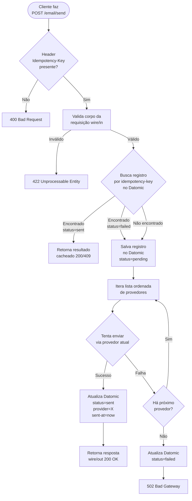
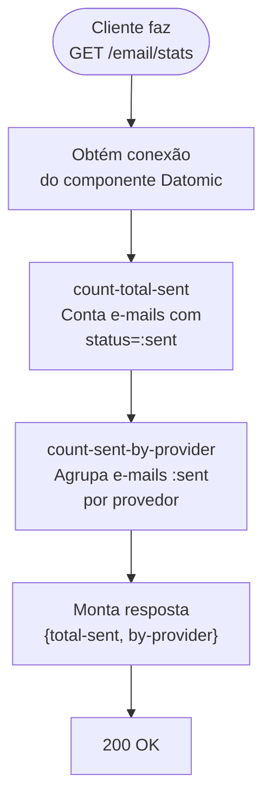

[](https://dashboard.nu.workflows.dev/repositories/nubank/mailbox-challenge/workflows/build-deploy.yaml?filters=branch%3Amain)

# mailbox-challenge

`mailbox-challenge` é um serviço de envio de e-mails inspirado no serviço interno [mailbox](https://github.com/nubank/mailbox) do Nubank. Ele abstrai a comunicação com provedores de entrega de e-mail (Mailgun, SendGrid) expondo uma API unificada.

---

## O que ele resolve?

Serviços de negócio não precisam saber qual provedor de e-mail está sendo usado, nem lidar com falhas de entrega. O `mailbox-challenge` centraliza essas responsabilidades:

- Seleciona o **provedor primário** e faz fallback automático para os demais em caso de falha.
- **Registra cada tentativa** no banco (timestamp, provedor, status).
- Garante **idempotência**: múltiplas requisições com a mesma `Idempotency-Key` retornam o resultado original sem reenviar o e-mail.

---

## Fluxogramas

### `POST /email/send`



### `GET /email/stats`



---

## API

### `POST /email/send`

**Headers obrigatórios:**

| Header            | Tipo   | Descrição                             |
|-------------------|--------|---------------------------------------|
| `Idempotency-Key` | UUID   | Chave de deduplicação da requisição   |

**Body:**

```json
{
  "to":      "user@example.com",
  "from":    "noreply@nubank.com.br",
  "subject": "Seu cartão está em análise",
  "body":    "Olá, ..."
}
```

**Respostas:**

| Status | Situação                                                         |
|--------|------------------------------------------------------------------|
| `200`  | E-mail enviado com sucesso                                       |
| `409`  | Idempotency-Key já processada (retorna resultado original)       |
| `400`  | Header `Idempotency-Key` ausente                                 |
| `422`  | Corpo da requisição inválido                                     |
| `502`  | Todos os provedores falharam                                     |

**Exemplo de resposta 200:**

```json
{
  "id":        "3fa85f64-5717-4562-b3fc-2c963f66afa6",
  "status":    "sent",
  "provider":  "mailgun",
  "sent_at":   "2026-04-20T12:00:00Z"
}
```

### `GET /email/stats`

**Respostas:**

| Status | Situação                                  |
|--------|-------------------------------------------|
| `200`  | Estatísticas retornadas com sucesso        |

**Exemplo de resposta 200:**

```json
{
  "total-sent": 42,
  "by-provider": [
    {"provider": "mailgun",  "count": 35},
    {"provider": "sendgrid", "count": 7}
  ]
}
```

---

## Arquitetura e componentes

```
mailbox-challenge/
├── src/mailbox_challenge/
│   ├── server.clj                        # Entry point
│   ├── config.clj                        # Config + lista ordenada de provedores
│   ├── components.clj                    # Stuart Sierra Component map
│   ├── models/
│   │   └── email.clj                     # Schema de domínio
│   ├── wire/
│   │   ├── in/email.clj                  # Schema de entrada HTTP (validação)
│   │   └── out/email.clj                 # Schema de saída HTTP
│   ├── diplomat/
│   │   ├── http_server.clj               # Rotas Pedestal + handlers
│   │   ├── http_client.clj               # Bookmarks para APIs dos provedores
│   │   ├── datomic/
│   │   │   └── email.clj                 # Schema Datomic + queries
│   │   └── providers/
│   │       ├── protocol.clj              # Protocolo EmailProvider
│   │       ├── mailgun.clj               # Implementação Mailgun
│   │       └── sendgrid.clj              # Implementação SendGrid
│   ├── logic/
│   │   └── email.clj                     # Lógica pura: fallback, idempotência
│   └── controllers/
│       └── email.clj                     # Orquestração do fluxo completo
└── test/
    ├── unit/mailbox_challenge/
    │   └── logic/email_test.clj
    └── integration/integration/
        └── service_test.clj
```

### Camadas (de fora para dentro)

| Camada                    | Responsabilidade                                                   |
|---------------------------|--------------------------------------------------------------------|
| `wire/in/`                | Valida e coerce o body HTTP de entrada                             |
| `wire/out/`               | Valida o body HTTP de saída                                        |
| `diplomat/http_server`    | Rotas Pedestal, interceptors comuns, handlers                      |
| `diplomat/http_client`    | Configuração de bookmarks para chamadas HTTP externas              |
| `diplomat/datomic/`       | Persistência e consultas Datomic                                   |
| `diplomat/providers/`     | Implementações de provedores de e-mail via protocolo               |
| `logic/`                  | Lógica pura (sem efeitos colaterais): seleção de provider, fallback |
| `controllers/`            | Orquestra DB + provedores + resposta HTTP                          |

---

## Passo a passo de implementação

### Passo 1 — Schema de domínio (`models/email.clj`)

Defina o modelo interno com Schema:

```clojure
(s/defschema Email
  {:id              s/Uuid
   :idempotency-key s/Str
   :to              s/Str
   :from            s/Str
   :subject         s/Str
   :body            s/Str
   :status          s/Keyword   ;; :pending | :sent | :failed
   (s/optional-key :provider) (s/maybe s/Keyword)
   (s/optional-key :sent-at)  (s/maybe java.util.Date)
   :created-at      java.util.Date})
```

---

### Passo 2 — Schema Datomic + queries (`diplomat/datomic/email.clj`)

Defina o schema Datomic e as três operações essenciais:

```clojure
;; Schema
[{:db/ident :email/id              :db/valueType :db.type/uuid    :db/unique :db.unique/identity ...}
 {:db/ident :email/idempotency-key :db/valueType :db.type/string  :db/unique :db.unique/identity ...}
 {:db/ident :email/to              :db/valueType :db.type/string  ...}
 {:db/ident :email/from            :db/valueType :db.type/string  ...}
 {:db/ident :email/subject         :db/valueType :db.type/string  ...}
 {:db/ident :email/body            :db/valueType :db.type/string  ...}
 {:db/ident :email/status          :db/valueType :db.type/keyword :db/index true ...}
 {:db/ident :email/provider        :db/valueType :db.type/keyword ...}
 {:db/ident :email/sent-at         :db/valueType :db.type/instant ...}
 {:db/ident :email/created-at      :db/valueType :db.type/instant ...}]

;; Funções
(defn save-email! [datomic email] ...)
(defn update-status! [datomic id status provider sent-at] ...)
(defn find-by-idempotency-key [datomic key] ...)
```

---

### Passo 3 — Protocolo de provedores (`diplomat/providers/protocol.clj`)

```clojure
(defprotocol EmailProvider
  (provider-name [this])
  (send-email! [this email http]))
```

Cada provedor implementa o protocolo como um record:

```clojure
;; diplomat/providers/mailgun.clj
(defrecord MailgunProvider []
  EmailProvider
  (provider-name [_] :mailgun)
  (send-email! [_ email http]
    ;; chama POST /mock/mailgun/send via common-http-client
    ))

;; diplomat/providers/sendgrid.clj
(defrecord SendGridProvider []
  EmailProvider
  (provider-name [_] :sendgrid)
  (send-email! [_ email http]
    ;; chama POST /mock/sendgrid/send via common-http-client
    ))
```

**Adicionar um novo provedor** = criar um novo record + registrá-lo em `config.clj`. Nenhuma outra mudança necessária.

---

### Passo 4 — Endpoints simulados dos provedores

Adicione rotas mock no `http_server.clj` para simular as APIs externas durante desenvolvimento e testes:

```
POST /mock/mailgun/send   → 200 OK (ou 500 para testar fallback)
POST /mock/sendgrid/send  → 200 OK
```

Use um flag de config ou header para forçar falhas e validar o comportamento de fallback.

Configure os bookmarks no `http_client.clj`:

```clojure
(def bookmarks-settings
  {:mailgun-send  {:method :post :url "http://localhost:8080/mock/mailgun/send"}
   :sendgrid-send {:method :post :url "http://localhost:8080/mock/sendgrid/send"}})
```

---

### Passo 5 — Lógica de negócio (`logic/email.clj`)

Funções puras, sem efeitos colaterais:

```clojure
;; Verifica idempotência: retorna email existente ou nil
(defn already-processed? [idempotency-key datomic] ...)

;; Itera provedores em ordem; retorna {:success? true :provider :mailgun} ou lança
(defn try-providers! [providers email http]
  (loop [[provider & rest] providers]
    (if (nil? provider)
      {:success? false}
      (try
        (send-email! provider email http)
        {:success? true :provider (provider-name provider)}
        (catch Exception _
          (recur rest))))))
```

---

### Passo 6 — Controller (`controllers/email.clj`)

Orquestra o fluxo completo:

```
1. Extrai idempotency-key do header
2. Checa Datomic: se status=sent → retorna 409 com resultado cacheado
3. Salva registro com status=pending
4. Chama try-providers!
   - Sucesso → atualiza status=sent, provider, sent-at
   - Falha total → atualiza status=failed → retorna 502
5. Retorna resposta wire/out
```

---

### Passo 7 — Camada HTTP (`diplomat/http_server.clj`)

Adicione a rota de envio:

```clojure
["/email/send"
 :post (conj common-interceptors
             (doc/desc "Send an email")
             (auth/public)
             (adapt/internalize! wire.in.email/SendEmailRequest)
             (adapt/externalize! {200 wire.out.email/EmailResponse
                                  409 wire.out.email/EmailResponse})
             email-controller/send-email!)
 :route-name :email-send]
```

Defina os schemas de entrada e saída:

```clojure
;; wire/in/email.clj
(s/defschema SendEmailRequest
  {:to      s/Str
   :from    s/Str
   :subject s/Str
   :body    s/Str})

;; wire/out/email.clj
(s/defschema EmailResponse
  {:id       s/Uuid
   :status   s/Keyword
   :provider (s/maybe s/Keyword)
   :sent-at  (s/maybe java.util.Date)})
```

---

### Passo 8 — Registro de provedores em `config.clj`

```clojure
(defn ordered-providers
  "Retorna provedores em ordem de prioridade. Primeiro = primário."
  [mailgun sendgrid]
  [mailgun sendgrid])
```

---

### Passo 9 — Testes unitários (`test/unit/`)

Teste a lógica pura em isolamento:

- `try-providers!` com todos os provedores falhando → retorna `{:success? false}`
- `try-providers!` com provider primário falhando → usa fallback
- `already-processed?` com chave existente → retorna o email
- `already-processed?` com status `:failed` → permite retry

---

### Passo 10 — Testes de integração (`test/integration/`)

Use `state-flow` + `defflow` + `state-flow.helpers.http-client/with-responses`:

```clojure
;; Cenário 1: envio bem-sucedido
(defflow send-email-success
  (flow "sends email via primary provider"
    (sf.servlet/request :post "/email/send"
                        {:headers {"idempotency-key" (str (random-uuid))}
                         :body    {:to "a@b.com" :from "x@y.com"
                                   :subject "Test" :body "Hi"}})
    (match? {:status 200 :body {:status "sent" :provider "mailgun"}})))

;; Cenário 2: fallback quando mailgun falha
;; Cenário 3: replay com mesma Idempotency-Key retorna 409 sem reenviar
```

---

### Passo 11 — Smoke test manual

```bash
# Start REPL
lein run-dev

# Enviar e-mail
curl -X POST http://localhost:8080/email/send \
  -H "Content-Type: application/json" \
  -H "Idempotency-Key: $(uuidgen)" \
  -d '{"to":"a@b.com","from":"x@y.com","subject":"Oi","body":"Teste"}'

# Replay com mesma chave → deve retornar 409 sem chamar provedores

# Consultar estatísticas de envio
curl http://localhost:8080/email/stats
```

---

## Decisões de design

| Decisão | Escolha | Motivo |
|---------|---------|--------|
| Abstração de provedores | Protocol + records | Extensível sem alterar código existente (Open/Closed) |
| Dispatch | Síncrono | Mais simples; async via Kafka é stretch goal |
| Idempotência em `:failed` | Permite retry | Caller sabe que não foi enviado; pode tentar novamente |
| Endpoints simulados | Rotas `/mock/*` no próprio serviço | Sem dependências externas em dev/test |

---

## Comandos de desenvolvimento

```bash
lein test          # Todos os testes
lein unit          # Apenas testes unitários
lein integration   # Apenas testes de integração
lein lint          # Verificar estilo
lein lint-fix      # Corrigir automaticamente
lein run-dev       # REPL de desenvolvimento (sistema auto-inicializado)
```

---

## Stretch goals

- Envio assíncrono via Kafka: `POST /email/send-async` produz mensagem; consumer chama `try-providers!`
- Retry com backoff exponencial por provedor antes de passar ao fallback
- Circuit breaker por provedor (pula provedores com falhas consecutivas)
- Métricas: contagem de envios e taxa de falha por provedor
